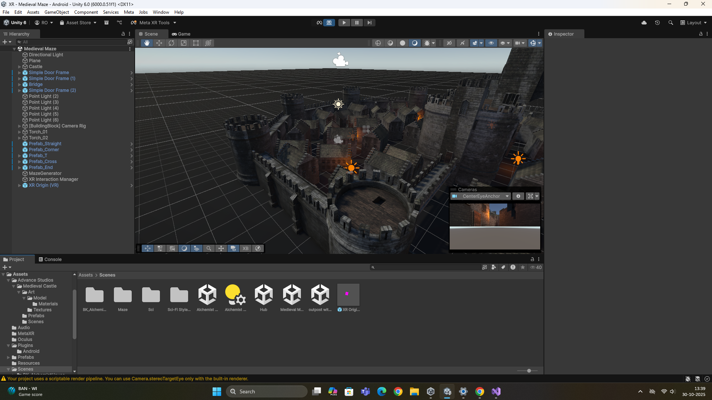
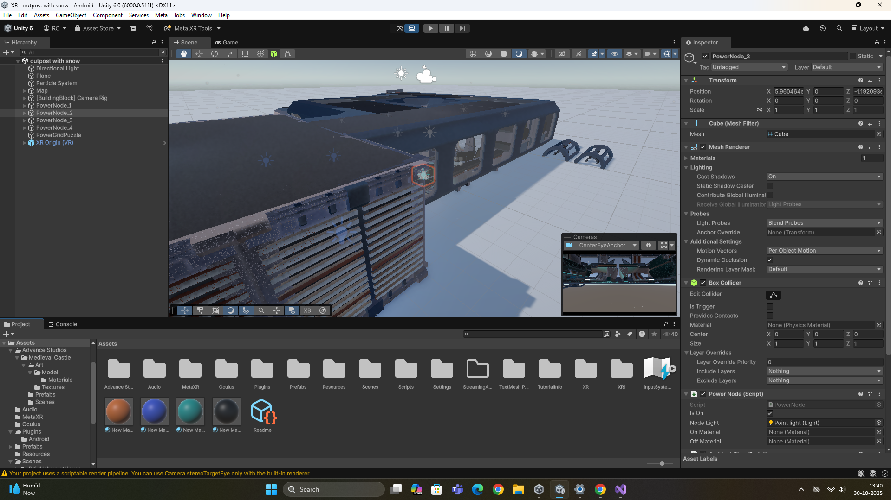
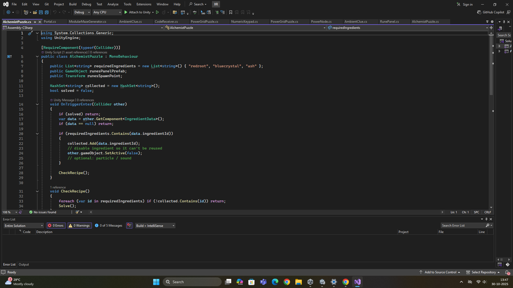

# Spellbound Escape  

An **AI-powered AR/VR escape-room adventure** built in **Unity** using **Meta XR SDK**.  
Explore portals that transport you between mystical realms — from ancient temples to futuristic spaceships — where every puzzle adapts to your playstyle.  

---

## About the Project  

This project was developed as part of our **Augmented and Virtual Reality** subject to explore immersive 3D interaction, scene linking, and adaptive AI systems in virtual spaces.  

**Spellbound Escape** merges storytelling, exploration, and intelligence — without combat — to create a peaceful yet challenging escape experience driven by curiosity and logic.  

---

## Features  

- 🧠 **AI-powered Game Master** - dynamically adjusts puzzles and hints.  
- 🌌 **Multi-realm design** - teleport between worlds like temples, cities, and spaceships via magical portals.  
- 🪄 **Voice & gesture-based spellcasting** for immersive interaction.  
- 🧩 **Adaptive difficulty system** - challenges scale based on player performance.  
- 🔊 **AI narration** and guided storytelling through voice.  

---

## Tech Stack  

- **Game Engine:** Unity 2022+  
- **SDK:** Meta XR / Oculus Integration  
- **Language:** C#  
- **AI Integration:** Unity ML Agents / custom logic-based system  
- **Platform:** VR (Meta Quest compatible)  

---

## Development Flow  

1. Environment design and portal linking  
2. Scene transitions setup using Unity triggers  
3. Integration of AI-driven puzzle logic  
4. Voice and gesture input system setup  
5. Testing, debugging, and immersive flow optimization  

---

Download the Unity package:
([https://drive.google.com/](https://drive.google.com/file/d/15VNZ8Z_gTyDw797TLJWFhCV804WJ3hS0/view?usp=sharing))

---

## Collaboration  

Developed by **Reya Oberoi** and **Vidhi Damani**  

---

## Future Enhancements  

- AI-based narrative branching  
- Real-time voice assistant integration  
- Dynamic lighting based on player actions  

---

## Screenshots / Demo

Here’s a glimpse into some of the realms inside *Spellbound Escape* ✨  

---

## Inspiration  

Inspired by the immersive worlds of *Harry Potter* and the mystery of escape-room puzzles — reimagined in the realm of XR technology.  

---

## Tags  

`#ARVR` `#Unity` `#MetaXR` `#AI` `#EscapeRoom` `#VirtualReality` `#GameDev`  

---

## Unity Package  

All source files and scenes are packaged in `SpellboundEscape.unitypackage`.  
Import it into Unity (version 2022 or higher) to explore or modify the project.  

---

##  License  

This project is licensed under the **MIT License** — see the [LICENSE](./LICENSE) file for details.  
